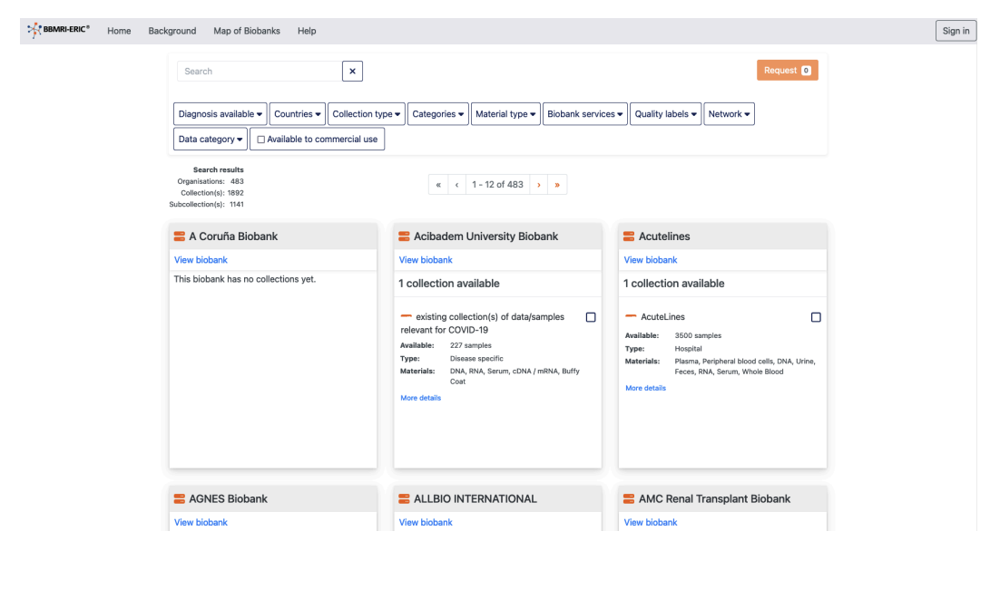

# Biobank Onboarding Guide
## BBMRI-ERIC Directory

**Version 1.0 | December 2024**

---

## Quick Start: What You Need to Know

The BBMRI-ERIC Directory is Europe's catalogue of biobanks and sample collections. Being listed makes your biobank discoverable to researchers across Europe and facilitates collaborations.

---

## Step 1: Prepare Your Information

Before you start, gather the following information:

### ✅ Biobank Information
- [ ] Official biobank name and acronym (if any)
- [ ] English description (2-3 paragraphs about what you do)
- [ ] Website URL
- [ ] Physical location (city, country)
- [ ] Legal entity name (the official organization name)
- [ ] Coordinates (optional but recommended for map display)

### ✅ Contact Person(s)
- [ ] Name(s) of primary contact(s)
- [ ] Email address(es) - **REQUIRED**
- [ ] Phone number(s)
- [ ] Mailing address

### ✅ Collection Information
For each collection you want to list:
- [ ] Collection name and description (in English)
- [ ] Type: samples, data, or images?
- [ ] Approximate number of samples (order of magnitude: 10, 100, 1,000, 10,000, etc.)
- [ ] Sample types (DNA, tissue, blood, plasma, etc.)
- [ ] Diseases covered (ICD-10 codes)
- [ ] Data available (medical records, genomic data, imaging, etc.)
- [ ] Donor information (number, age range, sex distribution)
- [ ] Storage conditions (temperature)
- [ ] Access policy (how can researchers request samples?)

### ✅ Quality & Certification (if applicable)
- [ ] ISO certifications
- [ ] Quality standards
- [ ] Accreditations

---

## Step 2: Request Access

### 2.1 Contact Your National Node

Each country has a National Node coordinator who manages biobank data for that country.

**Find your coordinator:**
1. Visit [https://directory.bbmri-eric.eu](https://directory.bbmri-eric.eu)
2. Look for your country's National Node
3. Send them an email expressing interest in joining

**What to include in your email:**
```
Subject: New Biobank - Request to Join BBMRI-ERIC Directory

Dear [National Node Coordinator],

We are [Your Biobank Name] based in [City, Country] and would like to 
register our biobank in the BBMRI-ERIC Directory.

Biobank details:
- Name: [Your biobank name]
- Institution: [Your institution]
- Contact person: [Your name and email]
- Collections: [Brief description of what you collect]

Could you please guide us through the onboarding process?

Best regards,
[Your name]
```

### 2.2 Get Login Credentials

Once your National Node approves, you need login access:

1. Go to [https://directory.bbmri-eric.eu](https://directory.bbmri-eric.eu)
2. Click **"Sign in"** in the top right



3. Choose your login method:
   - **Institutional login** - if your institution is listed
   - **LifeScience Hostel** - if your institution is not available

4. If using LifeScience Hostel:
   - Create a free account
   - Email **support@molgenis.org** with:
     ```
     Subject: Access Request - BBMRI-ERIC Directory Data Manager
     
     Name: [Your name]
     Email: [Your email]
     Country: [Your country]
     National Node: BBMRI-[country code]
     Role: Data Manager
     ```
   - Wait for access confirmation (usually 1-3 business days)

---

## Step 3: Understand ID Structure (Critical!)

**⚠️ MOST IMPORTANT RULE:** All IDs must follow a specific format.

### ID Format Rules

| What | Format | Example |
|------|--------|---------|
| **Biobank** | `bbmri-eric:ID:<CC>_<your_id>` | `bbmri-eric:ID:AT_MUG` |
| **Collection** | `<biobank_id>:collection:<your_id>` | `bbmri-eric:ID:AT_MUG:collection:COVID` |
| **Contact** | `bbmri-eric:contactID:<CC>_<your_id>` | `bbmri-eric:contactID:AT_JSMITH` |
| **Network** | `bbmri-eric:networkID:<CC>_<your_id>` | `bbmri-eric:networkID:AT_CANCER` |

Where:
- `<CC>` = Your 2-letter country code (AT, DE, FR, IT, etc.)
- `<your_id>` = Your chosen identifier (letters, numbers, hyphens, underscores only)

**Examples:**
- Austria, Medical University Graz: `bbmri-eric:ID:AT_MUG`
- Germany, Charité Biobank: `bbmri-eric:ID:DE_CHARITE`
- Italy, Milano Biobank: `bbmri-eric:ID:IT_MILANO`

---

## Step 4: Enter Your Data

You have two options: **Manual Entry** (easier) or **File Upload** (faster for multiple collections).

### Option A: Manual Data Entry (Recommended for First Time)

#### 4.1 Access Your Staging Area

1. Log in to [https://directory.bbmri-eric.eu](https://directory.bbmri-eric.eu)
2. Click **"Navigator"** in the top menu
3. Select your country's staging area (e.g., **BBMRI-AT**, **BBMRI-DE**)


#### 4.2 Enter Contact Person FIRST

**Why first?** You'll need to reference the contact when creating your biobank.

1. Click **"Persons"** table
2. Click **"+"** to add new
3. Fill in:
   - **ID**: `bbmri-eric:contactID:<CC>_<lastname>` (e.g., `bbmri-eric:contactID:AT_SMITH`)
   - **Email**: your.email@institution.com (**REQUIRED**)
   - **First name**: John
   - **Last name**: Smith
   - **Country**: Select from dropdown
   - **Phone**: +43 316 123456 (use international format)
   - **Address, City, ZIP**: Optional but recommended
4. Click **"Save Persons"**


#### 4.3 Create Your Biobank Entry

1. Go back, click **"Biobanks"** table
2. Click **"+"** to add new
3. Fill in required fields:

**Required Fields:**
- **ID**: `bbmri-eric:ID:<CC>_<yourbiobank>` (e.g., `bbmri-eric:ID:AT_MUG`)
- **Name**: Medical University of Graz Biobank
- **Description**: Write 2-3 paragraphs in English describing your biobank
- **Country**: Select from dropdown
- **Contact**: Select the contact you just created
- **Juridical person**: Medical University of Graz (legal entity name)

**Recommended Fields:**
- **Acronym**: MUG Biobank
- **URL**: https://biobank.medunigraz.at
- **Location**: Graz
- **Latitude**: 47.0707 (for map display)
- **Longitude**: 15.4395
- **Collaboration (commercial)**: Yes/No
- **Collaboration (non-profit)**: Yes/No

4. Click **"Save Biobanks"**


#### 4.4 Add Your Collection(s)

1. Click **"Collections"** table
2. Click **"+"** to add new
3. Work through the tabs:

**📋 Descriptives Tab (Required):**
- **ID**: `<your_biobank_id>:collection:<collection_name>`
  - Example: `bbmri-eric:ID:AT_MUG:collection:COVID19`
- **Name**: COVID-19 Sample Collection
- **Description**: Detailed description in English
- **Country**: Select from dropdown
- **Contact**: Select contact person
- **Biobank**: Select your biobank from dropdown

**🏥 Characteristics Tab (Required):**
- **Type**: Select one or more:
  - Sample collection
  - Data collection  
  - Image collection
- **Data categories**: Select all that apply:
  - Biological samples
  - Medical records
  - Genomic data
  - Imaging data
  - Survey data
  - etc.
- **Order of magnitude**: Select the range that fits your sample count:
  - 0 = 1-9 samples
  - 1 = 10-99 samples
  - 2 = 100-999 samples
  - 3 = 1,000-9,999 samples
  - 4 = 10,000-99,999 samples
  - 5 = 100,000-999,999 samples
  - 6 = 1,000,000+ samples

**👥 Donor Data Tab (Recommended):**
- **Number of donors**: 523 (exact number if known)
- **Sex**: Select: Male, Female, Unknown
- **Age low**: 18 (minimum age)
- **Age high**: 85 (maximum age)
- **Age unit**: Select: YEAR, MONTH, WEEK
- **Diagnosis available**: Add disease codes
  - Use ICD-10: `urn:miriam:icd:U07.1` (for COVID-19)
  - Or Orphanet: `ORPHA:558` (for rare diseases)

**🧬 Sample Data Tab (if applicable):**
- **Materials**: Select all that apply:
  - DNA
  - RNA
  - Plasma
  - Serum
  - Tissue (frozen)
  - Tissue (FFPE)
  - Whole blood
  - etc.
- **Storage temperatures**: Select:
  - -80°C
  - Liquid nitrogen
  - -20°C
  - etc.

**📜 Policies Tab (Recommended):**
- **Collaboration commercial**: Yes/No
- **Collaboration non-profit**: Yes/No
- **Access description**: Write how researchers can request samples
  - Example: "Access requests reviewed by scientific committee monthly"
- **Access URI**: URL to your access policy page (if available)

4. Click **"Save Collections"**


#### 4.5 Review Your Data

1. Click through each table (Persons, Biobanks, Collections)
2. Check all information is correct
3. Edit any entry by clicking the pencil icon ✏️

### Option B: File Upload (For Multiple Collections)

If you have many collections or existing data in spreadsheets:

#### 4.1 Download the Template

1. Log in and go to your staging area
2. Click **"Data Integration"** → **"Upload/Download"**
3. Click **"excel"** to download template


#### 4.2 Fill in the Template

The Excel file has multiple sheets:
- **Persons** - Contact information
- **Biobanks** - Your biobank(s)
- **Collections** - Your collection(s)
- **Networks** - Networks you belong to (optional)

**Important formatting rules:**
- Keep column headers exactly as they are
- Use quotes around text: `"Medical University Graz"`
- Use comma-separated lists: `"DNA,RNA,Plasma"`
- Use ISO format for dates: `2024-12-15`
- Leave optional fields empty (don't use "N/A" or "null")
- Follow ID structure rules strictly

#### 4.3 Upload Your File

1. Click **"Data Integration"** → **"Upload/Download"**
2. Click **"Browse"** and select your Excel file
3. Click **"Import"**
4. Watch the progress:
   - ✅ Green = Success
   - ⚠️ Yellow = Warning (review but may be OK)
   - ❌ Red = Error (must fix)


5. If errors occur:
   - Screenshot the error message
   - Fix in your Excel file
   - Upload again

6. Click **"Done"** when successful

---

## Step 5: Verify & Publish

### 5.1 Check Your Staging Area

Your data is now in your **staging area** - only you can see it.

1. Review each table in your staging area
2. Check for completeness
3. Make any corrections

### 5.2 Wait for Publication

**Important:** Data is published automatically **every night at ~02:00 CET**.

```
Day 1 (Today):     You enter/edit data in staging area
Night:             Automated job runs (02:00 CET)
Day 2 (Tomorrow):  Your data is LIVE in public directory
```

### 5.3 Verify Publication

The next day after your data entry:

1. Go to [https://directory.bbmri-eric.eu](https://directory.bbmri-eric.eu)
2. Search for your biobank name
3. Click on your biobank
4. Verify all information appears correctly
5. Check your collections are listed


**If something is wrong:**
- Go back to your staging area
- Make corrections
- Wait for next night's publication

---

## Common Mistakes to Avoid

### ❌ Wrong ID Format
```
Wrong: AT_MUG
Right: bbmri-eric:ID:AT_MUG
```

### ❌ Missing Required Fields
Every biobank MUST have:
- ID, Name, Description, Country, Contact, Juridical person

Every collection MUST have:
- ID, Name, Description, Country, Biobank, Type, Data categories, Order of magnitude, Contact

### ❌ Invalid Character in IDs
```
Wrong: bbmri-eric:ID:AT_MUG Biobank (space not allowed)
Wrong: bbmri-eric:ID:AT_MUG/COVID (slash not allowed)
Right: bbmri-eric:ID:AT_MUG_BIOBANK
Right: bbmri-eric:ID:AT_MUG-COVID
```

### ❌ Referencing Non-existent Contact
You must create the contact BEFORE referencing it in biobank/collection.

### ❌ Wrong Age Range
```
Wrong: Age low: 65, Age high: 18
Right: Age low: 18, Age high: 65
```

### ❌ Disease Codes Without Prefix
```
Wrong: C50
Right: urn:miriam:icd:C50
```

---

## Getting Help

### 🆘 Support Contacts

**Technical Issues:**
- Email: support@molgenis.org
- Include screenshots of errors
- Mention your National Node code

**Your National Node:**
- Contact your National Node coordinator
- They know country-specific requirements
- Can help with data quality

**BBMRI-ERIC:**
- Website: [https://www.bbmri-eric.eu](https://www.bbmri-eric.eu)
- Email: directory@bbmri-eric.eu

### 📚 Useful Resources

- **ICD-10 Disease Codes**: [https://icd.who.int/browse10/2019/en](https://icd.who.int/browse10/2019/en)
- **Orphanet Rare Diseases**: [https://www.orpha.net](https://www.orpha.net)
- **Full Technical Manual**: [Available in the Directory](https://directory.bbmri-eric.eu/ERIC/pages/#/Help)
- **Quality Assessment**: [https://www.bbmri-eric.eu/services/self-assessment-survey/](https://www.bbmri-eric.eu/services/self-assessment-survey/)

---

## After Onboarding: Next Steps

### ✅ You're Live!

Congratulations! Your biobank is now discoverable by researchers across Europe.

### 🔄 Keep Your Data Current

- Review your data **quarterly**
- Update sample counts
- Add new collections
- Update contact information if it changes

### ⭐ Apply for Quality Marks

**IMPORTANT:** Only apply AFTER your biobank is published in the Directory.

1. Complete the BBMRI-ERIC Self-Assessment Survey
2. Visit: [https://www.bbmri-eric.eu/services/self-assessment-survey/](https://www.bbmri-eric.eu/services/self-assessment-survey/)
3. Quality marks will be added to your Directory entry

Quality marks increase trust and visibility!

### 🌐 Join Networks

Consider joining disease-specific or regional networks:
- Increases visibility
- Facilitates collaborations
- Access to specialized resources

Contact your National Node about relevant networks.

### 📊 Add More Details

Enhance your entry with:
- **Services**: Sequencing, data analysis, sample processing
- **Studies**: Research studies that generated collections
- **Collection Facts**: Detailed sample aggregates for researchers

---

## Success! 🎉

You've successfully onboarded your biobank to the BBMRI-ERIC Directory!

Your biobank is now part of Europe's largest biobanking network, discoverable by thousands of researchers.

**Welcome to BBMRI-ERIC!**

---

*For questions about this guide, contact: support@molgenis.org*

*Last updated: December 2024 | Version 1.0*
