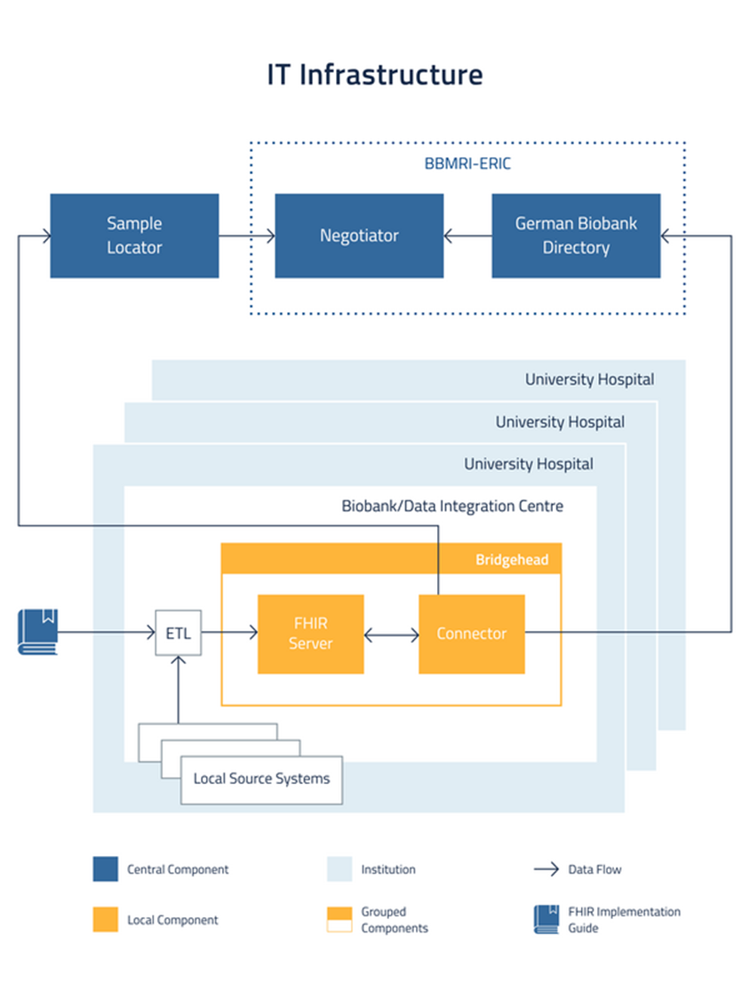

# Federated Search Platform: Overview for New Biobanks

## What It Is

The Federated Search Platform enables researchers to discover biological samples and associated data across multiple biobanks **without centralizing or transferring samples or data**. Your samples and data remain under your control at your location.

## How It Works

1. **Your data stays local** - Your biobank operates as a local node with full control over samples and data
2. **Queries are distributed** - Researchers submit queries through the central platform, which forwards them to participating biobanks
3. **You process locally** - Your biobank processes queries on-site and returns only aggregated, non-personal results (e.g., counts by gender, diagnosis, sample type)
4. **Results are aggregated** - The platform combines responses and presents them to researchers
5. **Access follows existing procedures** - Sample/data access still requires direct negotiation between you and the researcher

## Key Benefits

- **Maintain autonomy** - Full control over your samples and data
- **Ensure compliance** - Meet data protection regulations by keeping personal data local
- **Enable collaboration** - Participate in multi-biobank research without data transfer
- **Support national strategies** - Hierarchical model supports biobank, national, and BBMRI-ERIC level operations

## BBMRI-ERIC Implementation

The platform provides:
- Federated search across rich clinical, genetic, and sample data
- Expedited data access workflows
- Federated data analysis capabilities

**Integration**: Works seamlessly with [BBMRI-ERIC](https://www.bbmri-eric.eu/) [Directory](Directory.md) and [Negotiator](Negotiater.md) services

**Infrastructure**: Vendor-neutral, standards-based architecture that interfaces with your existing local IT systems through open, documented APIs—no replacement of your current systems required

**Data governance**: Operated by [BBMRI-ERIC](https://www.bbmri-eric.eu/); your data never leaves the [BBMRI-ERIC](https://www.bbmri-eric.eu/) infrastructure or reaches technology vendors

